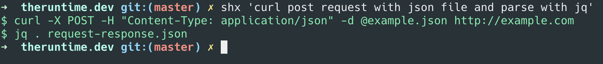

[shx](https://github.com/rajikaimal/shx) is a simple CLI tool to quickly find commands without leaving the terminal.
shx calls a Cloudflare Workers AI instance, which uses [llama3](https://blog.cloudflare.com/meta-llama-3-available-on-cloudflare-workers-ai) as the model to generate responses.
The Cloudflare Worker streams the response back to the CLI client.

## Tech stack

📎 CLI: [ink](https://github.com/vadimdemedes/ink)\
📎 Backend: [Cloudflare Workers AI](https://developers.cloudflare.com/workers-ai/)
